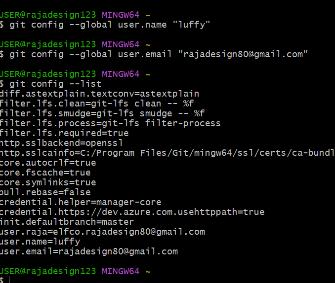
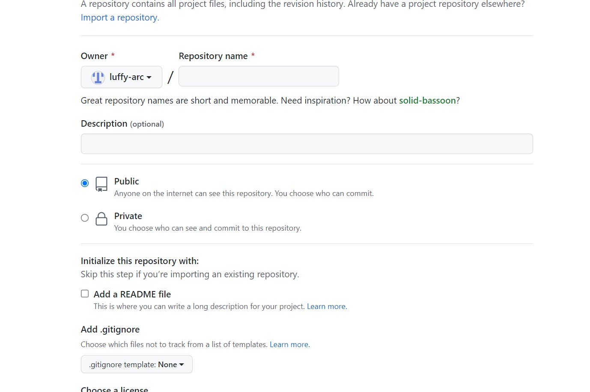

## **CARA PENGGUNAAN GIT BESERTA LANGKAH LANGKAHNYA**

# BERIKUT INI ADALAH LANGKAH LANGKAH MENGGUNAKAN GIT

### 1. **MASUK GIT**
untuk login ke git, bisa menggunakan git hub, jika anda sudah memilikinya silahkan daftarkan diri lewat **command prompt** atau **command line** ,kemudian masukkan perintah ini
---
$ git config --global user.name (input your name)
$ git config --global user.email (input your email)
---
selanjutnya untuk memastikan proses login berhasil, ketik perintah
---

$ git config --list
---

### 2. **MASUK GITHUB**
Untuk menggunakan git buat akun gihub  terlebih dulu. Github dan Git mempunyai hubungan khusus yaitu git sebagai version control sistem sedangkan github sebagai penyimpan kode pemograman.

### 3. **BUAT REPOSITORY**
setelah membuat akun github kini saat nya untuk membuat repository. klik tombol "new" pada menu **repository** untuk membuat repository baru. langkah langkahnya adalah sebagai berikut.
1) isi bagian nama repository
2) isi deskripsi
3) jenis repository publik atau privat
